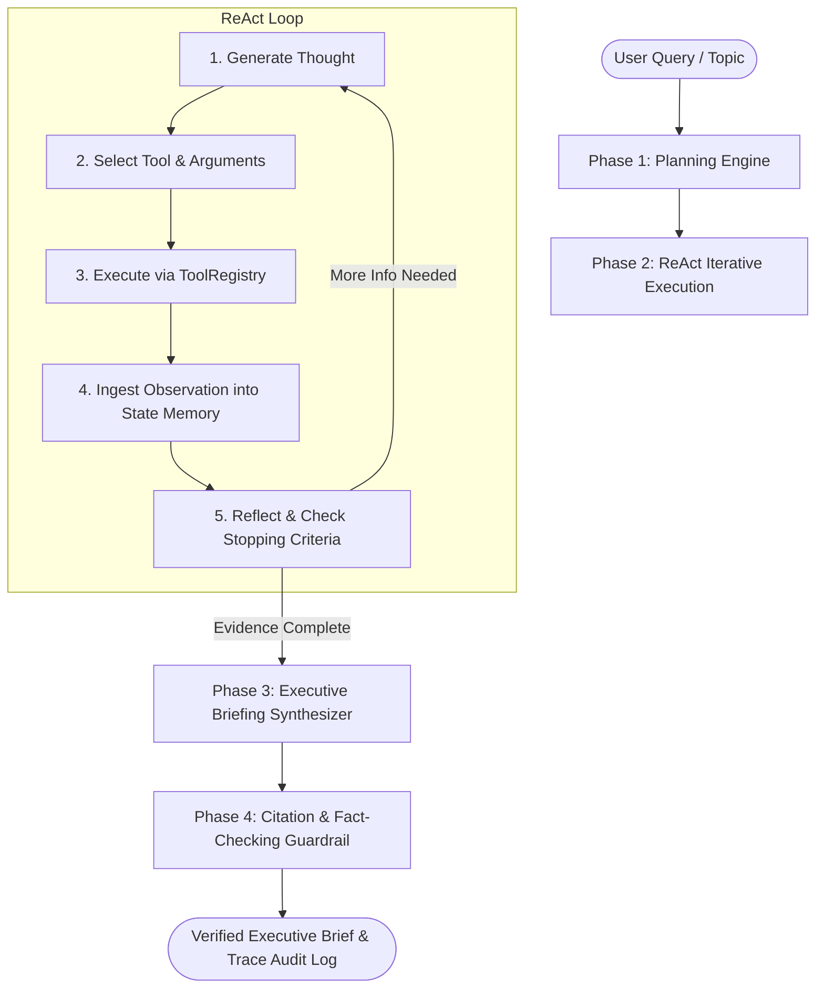

# Project 01: Autonomous ReAct Research & Briefing Agent with Citation Guardrails

> **Architecture Category**: Single-Agent Systems / Tool Use / Verification Guardrails  
> **Pattern**: ReAct (Reasoning + Acting + Observation + Reflection + Synthesis)  
> **Target Models**: Gemini 2.5 Flash / Flash Lite (or Deterministic Offline Mock)

---

## 📌 Executive Summary
This project implements an autonomous research and synthesis agent that deconstructs complex topics, iteratively plans investigative steps, invokes tools (search archives, document retrieval, numerical metrics calculation), and produces an audit-grade executive briefing. 

To eliminate hallucinations, the agent employs a post-synthesis **Deterministic Citation Guardrail** that cross-checks all assertions and quoted evidence directly against tool observation logs.

---

## 🏗️ Architecture Overview



---

## 🚀 Quick Start

### 1. Run with Deterministic Mock Engine (Zero Cost & 100% Offline)
```bash
python run.py --topic "State of Agentic AI 2026 & Token Economics"
```

### 2. Run with Live Gemini API
```bash
set GEMINI_API_KEY="your-api-key"
python run.py --topic "Enterprise MCP Integration" --live-gemini
```

### 3. Run Test Suite
```bash
python -m unittest discover tests
```

---

## 📂 Project Structure

```
01-react-research-brief-agent/
├── docs/
│   ├── coach-notes.md        # Comprehensive 360-degree beginner learning guide
│   └── run-report.md         # Autonomous engineering decisions & metrics
├── src/
│   ├── agent.py              # Core ReAct loop, LLM provider abstraction, state machine
│   ├── cli.py                # Command-line runner & visualization
│   ├── guardrails.py         # Citation containment & hallucination verification
│   ├── models.py             # Strongly-typed schemas (ToolCall, Citation, Brief)
│   └── tools.py              # Grounding tools (archive search, doc fetch, math)
├── tests/
│   ├── test_agent.py         # End-to-end integration tests
│   ├── test_guardrails.py    # Citation verification tests
│   └── test_tools.py         # Tool registry & calculation tests
├── README.md                 # Project overview & documentation
├── requirements.txt          # Dependency specification
└── run.py                    # Quick execution entrypoint
```
