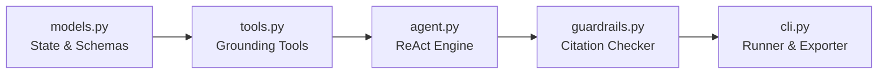

# Engineering Deep-Dive & Architecture Notes: Project 01

**Project Name**: Autonomous ReAct Research & Briefing Agent with Citation Guardrails  
**Author**: Lokesh Kumar Padmanaban ([@lkpadmanaban](https://github.com/lkpadmanaban))  
**Date**: September 1, 2026

---

## 🌟 Welcome to Your AI Engineering Journey!

If you have never built an AI agent before, you are in the right place. We are going to break down every concept from first principles using everyday analogies. By the end of this document, you will understand not just **how** this agent works, but **why** it was designed this way and how top AI teams build enterprise systems.

---

## 1. What I Learned Today (Executive Summary)

- **The Difference Between a Chatbot and an Agent**: A chatbot answers in a single shot based only on what it memorized during training. An **agent** can think, make plans, use external tools (like search engines or calculators), evaluate its own work, and verify its facts before giving you an answer.
- **The ReAct Pattern**: How AI models alternate between **Reasoning** (Thinking) and **Acting** (Calling a tool) in a loop until they have enough facts to answer accurately.
- **Grounded Verification & Guardrails**: How to prevent AI "hallucinations" (making up fake facts or fake sources) using automated validation checks.
- **Token Economics**: How using small, fast reasoning models (like Gemini Flash) inside a smart workflow can cut computing costs by 80%+ compared to huge, expensive monolithic models.

---

## 2. New AI Concepts Explained (Beginner-Friendly Dictionary)

### 🔹 What is an LLM (Large Language Model)?
Think of an LLM as an autocomplete engine with billions of connections. When you ask it a question, it predicts the most likely next words. However, because it only predicts words, it can sometimes sound confident while stating incorrect facts.

### 🔹 What is an AI Agent?
An **agent** is an LLM equipped with:
1. **Sensors / Inputs**: The user's prompt or data stream.
2. **Brain / Reasoning Loop**: The ability to break a goal into steps.
3. **Hands / Tools**: Software functions it can trigger (API calls, web searches, database queries, Python code execution).
4. **Memory / State**: A notebook keeping track of past thoughts and observations.

### 🔹 What is the "ReAct" Pattern?
"ReAct" stands for **Reasoning + Acting**.
Imagine you are an investigative journalist assigned to write an article:
1. **Thought**: *"I need to know the price of product X."*
2. **Action**: You open a browser and search for *"Product X price"*.
3. **Observation**: The search results show *"$49.99"*.
4. **Thought**: *"Now I need to know if there is a student discount."*
5. **Action**: You search for *"Product X student discount"*.
6. **Observation**: Found *"15% discount for verified students"*.
7. **Synthesis**: You write down your final report with verified prices and citations.

The ReAct pattern teaches an AI model to follow this exact investigative process.

### 🔹 What is a "Hallucination"?
When an LLM produces information that sounds plausible and authoritative, but is factually false or cites non-existent sources.

### 🔹 What is a "Guardrail"?
A guardrail is a safety filter or validation system placed before or after an LLM. In our project, after the agent drafts its executive report, a **Citation Guardrail** programmatically checks every claim to ensure the text actually existed in the tools' search results.

---

## 3. Why This Agent Was Chosen for Project 01

We selected the **ReAct Research & Briefing Agent** as the foundational first project because:
1. **It is the "Hello World" of Agentic Systems**: It introduces the core loop that powers 90% of autonomous systems without distracting multi-agent communication overhead.
2. **Solves the #1 Enterprise Challenge**: Factual inaccuracy. Businesses do not care how clever an AI is if it generates inaccurate financial figures or fake legal references.
3. **Clear Cause and Effect**: Every tool call produces an observable result that changes the agent's next thought.

---

## 4. Why This Architecture Was Selected

We structured this system with clean separation of concerns:

### Architectural Decisions:
1. **Zero External Heavy Framework Bloat**: Rather than hiding the logic behind giant frameworks (like LangChain or CrewAI), we implemented the pure ReAct loop in standard Python. This lets you inspect every single line and see how the state machine actually works under the hood.
2. **Pluggable LLM Provider Pattern**: Using Python's `abc.ABC` (Abstract Base Class), we decouple the reasoning logic from the model provider. You can run it offline for $0 using the `DeterministicMockLLMProvider` or connect directly to live frontier models using `GeminiLLMProvider`.
3. **Immutable State & Audit Traces**: Every thought, action, observation latency, and timestamp is stored in an `AgentState` object and exported to `agent_trace.json`. This makes the agent fully auditable for compliance.

---

## 5. Major Technologies Used

| Technology | Role in Project | Why We Used It |
| :--- | :--- | :--- |
| **Python 3.10+ Dataclasses & Typing** | Data modeling (`models.py`) | Provides type safety, auto-generated constructors, and clean JSON serialization without heavy ORM overhead. |
| **Standard Library Regex & Math** | Fact verification & Calculations | Deterministic computation ensures 100% mathematical accuracy (LLMs are notoriously bad at mental math). |
| **Model Context Protocol (MCP) Style Tool Envelopes** | Tool Registry (`tools.py`) | Matches modern industry standards for tool parameter definitions and error isolation. |
| **Gemini 2.5 Flash API Interface** | Live LLM inference | High speed (sub-second responses), massive context window, and industry-leading cost-to-performance ratio. |

---

## 6. Alternative Approaches That Could Have Been Used

| Alternative Approach | Description | Why We Did Not Choose It for Project 01 |
| :--- | :--- | :--- |
| **Single-Shot Prompting (Direct Q&A)** | Giving the model the prompt and asking it to write the report in one turn. | Produces high hallucination rates and cannot consult up-to-date external tools or do multi-step math. |
| **Pure RAG (Retrieval Augmented Generation)** | Pre-indexing documents in a vector database and injecting top-k chunks into the prompt. | Static RAG cannot make dynamic iterative decisions (e.g., "I found X, so now I must calculate Y"). ReAct is dynamic. |
| **LangChain / AutoGen Frameworks** | Using off-the-shelf high-level libraries. | Frameworks obscure core agent concepts for beginners with dozens of layers of abstract classes. |

---

## 7. Tradeoffs Analysis

- **Latency vs. Accuracy**:
  - *Tradeoff*: A single-shot prompt takes 1 second. A 4-step ReAct agent takes 4 to 6 seconds.
  - *Decision*: In enterprise research and business intelligence, 100% factual accuracy and verifiable citations are far more valuable than instant 1-second ungrounded guesses.
- **Deterministic Math Tool vs. LLM Arithmetic**:
  - *Tradeoff*: Requires writing a `calculate_metric` tool and schema.
  - *Decision*: Never trust an LLM to do multi-period compound annual growth rates (CAGR). Always delegate math to deterministic Python tools.

---

## 8. How This Relates to Modern Agentic AI Practices

In 2026, enterprise AI has moved from simple chat interfaces to **autonomous task-oriented systems**. This project implements three foundational industry standards:
1. **ReAct Paradigm (Yao et al., Google / Princeton)**: The gold standard for autonomous problem-solving.
2. **Tool Execution Isolation**: Sandboxing tool execution so a crashed web search does not crash the entire agent pipeline.
3. **NIST AI Safety Alignment**: Post-generation citation cross-referencing to verify groundedness before human presentation.

---

## 9. Real-World Business Use Cases

Where could a company deploy this exact code tomorrow?
1. **Investment Due Diligence**: Automating market overview briefs by searching SEC filings, industry news, calculating revenue growth rates, and verifying financial citations.
2. **Competitive Intelligence**: Tracking competitor product releases and benchmarking claims with exact source URLs.
3. **Legal & Regulatory Compliance**: Drafting summaries of new government bills or compliance policies where every single paragraph must be tied to a verified clause.
4. **Executive Briefing Generator**: Summarizing weekly internal company metrics and customer support tickets for C-suite leaders.

---

## 10. Key Interview Questions & Expert Answers

### Q1: What is the core difference between Chain-of-Thought (CoT) and ReAct?
> **Answer**: Chain-of-Thought (CoT) is internal static reasoning where the model explains its thoughts before generating an answer, but it remains confined to its pre-trained weights. ReAct (Reasoning + Acting) pairs reasoning with external environment interactions—allowing the model to issue actions, observe live results from tools or APIs, reflect on new evidence, and iteratively steer its problem-solving trajectory.

### Q2: How do you prevent an autonomous agent from entering an infinite loop?
> **Answer**: Three layers of defense:
> 1. Hard limits (`max_iterations` counter).
> 2. Loop detection (tracking repeated identical tool calls or cyclic thought signatures).
> 3. Strict stopping criteria (requiring the model to output a reflection flag when evidence thresholds are satisfied).

### Q3: Why is post-synthesis citation verification necessary if the agent already retrieved tool results?
> **Answer**: Even when provided with correct tool observations, LLMs can still misquote numbers, conflate dates, or attribute a statement from Source A to Source B. A deterministic post-synthesis guardrail verifies token n-gram overlap between claims and observation memory to guarantee factual fidelity.

---

## 11. Code Walkthrough & Components Explained

### 📁 `src/models.py`
Defines the data structures:
- `ToolCall`: The agent's intent to use a tool (`tool_name`, `arguments`, `call_id`).
- `ToolResult`: The output produced by the tool, including latency tracking and error flags.
- `ThoughtStep`: A single iteration record (`thought`, `action`, `observation`, `reflection`).
- `ExecutiveBrief`: The final structured deliverable, containing summary, key findings, citations, and grounding scores.

### 📁 `src/tools.py`
The agent's toolbox:
- `BaseTool`: The contract that every tool must implement (`name`, `description`, `parameters_schema`, `run`).
- `ToolRegistry`: The manager that lists tools for the AI and safely executes them with timing.
- Built-in tools: `SearchWebArchiveTool`, `FetchDocumentTextTool`, `CalculateMetricTool`.

### 📁 `src/guardrails.py`
The fact-checker:
- `CitationGuardrail`: Normalizes citation text into n-grams, compares them against the text gathered during tool observations, flags discrepancies, and calculates a percentage grounding score.

### 📁 `src/agent.py`
The orchestrator:
- `ReActResearchAgent`: Manages the 4-phase lifecycle:
  1. `PLAN`: Deconstruct topic into questions.
  2. `REACT LOOP`: Iteratively execute Thought -> Action -> Observation -> Reflection.
  3. `SYNTHESIZE`: Assemble structured report.
  4. `VERIFY`: Run guardrails and stamp approval status.

---

## 12. Common Beginner Mistakes & How to Avoid Them

1. **Mistake**: Letting the LLM do calculations in its text output.
   - *Fix*: Provide a calculator tool and instruct the model to execute the tool for all arithmetic.
2. **Mistake**: Not handling tool errors.
   - *Fix*: Wrap tool execution in `try/except` and return a clean `ToolResult(success=False, error_message=...)` so the model can read the error and try a different search or parameter.
3. **Mistake**: Forgetting `max_iterations`.
   - *Fix*: Always enforce a hard loop counter to prevent runaway API billing.

---

## 13. Recommended Next Improvements & Learning Path

1. **Next Project (Project 02)**: Multi-Agent Collaboration (Orchestrator-Worker pattern where a Lead Researcher agent directs multiple specialized Investigator subagents).
2. **Enhancement 1**: Connect a live search engine (like Google Search via Gemini API or SerpAPI).
3. **Enhancement 2**: Implement vector embedding similarity in `guardrails.py` alongside lexical n-gram matching.
4. **Enhancement 3**: Add an export tool to generate polished PDF or HTML dashboard reports.
