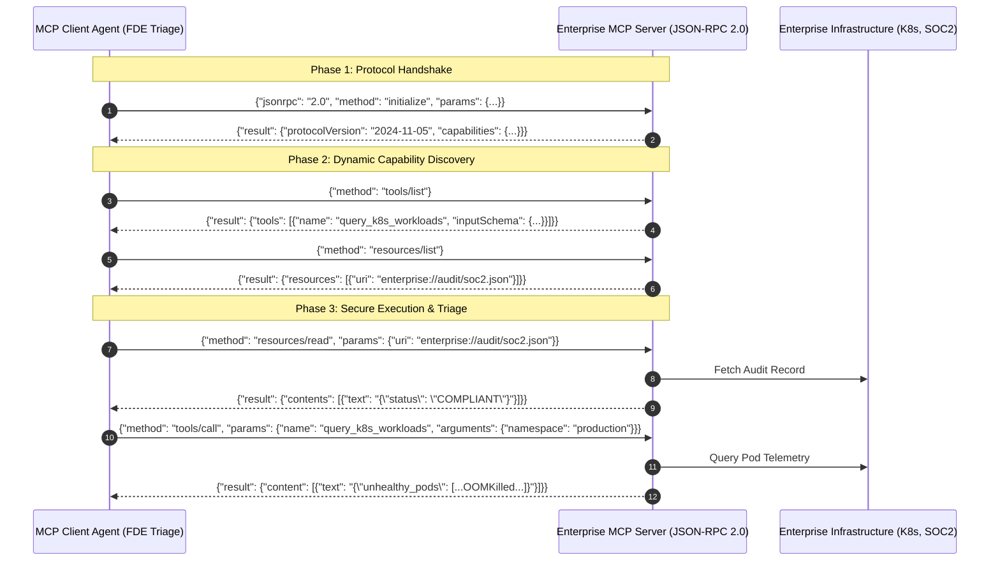

# Engineering Deep-Dive & FDE Field Manual: Project 03

**Project Name**: Model Context Protocol (MCP) Enterprise Tool Server & Client  
**Author**: Lokesh Kumar Padmanaban ([@lkpadmanaban](https://github.com/lkpadmanaban))  
**Target Roles**: Forward Deployed Engineer (FDE), Enterprise AI Platform Engineer  
**Date**: September 10, 2026

---

## 🌟 1. Why Model Context Protocol (MCP) is the #1 Enterprise AI Standard

In late 2024 and throughout 2026, **Anthropic and the Linux Foundation open-sourced MCP (Model Context Protocol)**. It rapidly became the universal standard for AI agent tool integration, analogous to how **HTTP/REST** unified web services and **LSP (Language Server Protocol)** unified IDEs.

### The Problem Before MCP:
- Every agent framework (LangChain, CrewAI, AutoGen, Semantic Kernel) invented its own proprietary tool definition format.
- Connecting an agent to enterprise databases (Snowflake, BigQuery), cloud infra (Kubernetes, AWS), or ticketing (Jira, ServiceNow) required rewriting custom glue code for every project.

### The MCP Solution:
- An enterprise builds **one MCP Server** exposing their secure tools and resources over JSON-RPC 2.0.
- **Any AI Agent** (Claude Desktop, custom agents, Gemini, Cursor, internal enterprise LLMs) can connect dynamically, discover capabilities via `tools/list`, and execute tools via `tools/call`.

---

## 2. Core Architecture & Protocol Mechanics

---

## 3. Real-World Failure Scenarios & In-Field FDE Troubleshooting

### Failure Scenario 1: Malformed Client Arguments Breaking Backend Services
- **Risk**: An LLM invents arbitrary parameters or passes strings when integers are required.
- **FDE Fix**: Strict server-side JSON Schema validation against `inputSchema`. If required parameters are missing, return standard JSON-RPC `-32602 (Invalid Params)` error immediately before executing any code.

### Failure Scenario 2: Tool Injection & Sensitive Command Execution
- **Risk**: Malicious prompt injections attempting to run `rm -rf /` or drop production tables.
- **FDE Fix**: Sandboxed handlers with strictly typed parameter schemas. Disallow raw shell execution tools in production MCP servers.

### Failure Scenario 3: Unauthorized Access to Internal MCP Endpoints
- **Risk**: Rogue agents accessing restricted HR or financial databases.
- **FDE Fix**: Header-based Bearer Token authorization or mTLS certificates mapped to user/agent service accounts.

---

## 4. Top Forward Deployed Engineer (FDE) Interview Q&As

### Q1: What is MCP and why should an enterprise adopt it over custom tool calling?
> **Answer**: Model Context Protocol (MCP) is an open standard that decouples AI models from data sources and tools. Instead of maintaining separate integrations for every framework, enterprises build a single MCP server exposing tools, resources, and prompts over standard JSON-RPC 2.0. This prevents vendor lock-in, unifies access control, and allows hot-swapping agent backends seamlessly.

### Q2: What are the three core primitives exposed by an MCP Server?
> **Answer**:
> 1. **Tools**: Functions the model can invoke to take action or fetch dynamic data (`tools/list`, `tools/call`).
> 2. **Resources**: Read-only contextual data, documents, or logs identified by custom URIs (`resources/list`, `resources/read`).
> 3. **Prompts**: Pre-configured prompt templates and multi-turn workflows maintained on the server (`prompts/list`, `prompts/get`).

### Q3: How do you secure an MCP deployment in a zero-trust enterprise environment?
> **Answer**: By enforcing mutual TLS (mTLS) between agent clients and the MCP server, validating all tool parameters against strict JSON Schemas, implementing token-based Role-Based Access Control (RBAC) per tool, and emitting structured audit logs for every `tools/call` invocation to an enterprise SIEM.
