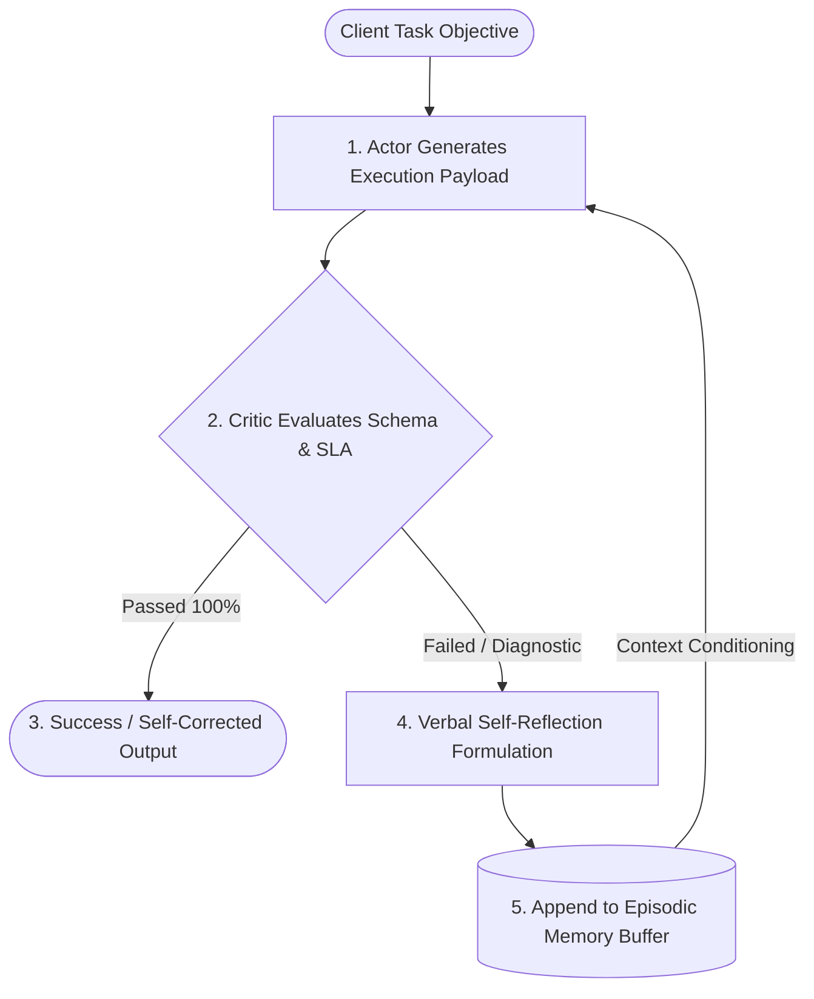

# Engineering Deep-Dive & FDE Field Manual: Project 04

**Project Name**: Loop Engineering — Self-Correcting Reflexion & Actor-Critic Agent  
**Author**: Lokesh Kumar Padmanaban ([@lkpadmanaban](https://github.com/lkpadmanaban))  
**Target Roles**: Forward Deployed Engineer (FDE), Lead AI Agent Architect  
**Date**: September 11, 2026

---

## 🌟 1. Why Loop Engineering & Reflexion Matter in Enterprise FDE

In traditional software, if an API client sends a payload with a schema error, it crashes and throws a `400 Bad Request`. In forward deployed AI engineering, asking a human engineer to intervene for minor syntax, UUID formatting, or parameter adjustments makes agentic pipelines commercially unviable.

### The Reflexion Paradigm (Shinn et al.):
Reflexion endows an AI agent with **verbal reinforcement learning** without modifying model weights:
1. **Actor**: Proposes an execution attempt.
2. **Evaluator / Critic**: Diagnoses specific failure symptoms (e.g., regex mismatch, out-of-bound RAM).
3. **Self-Reflection Formulation**: The agent verbalizes *why* its strategy failed.
4. **Episodic Memory Buffer**: The reflection is recorded as working context, conditioning the subsequent attempt.
5. **Self-Healing Convergence**: The agent fixes its own mistakes on retry, achieving autonomy in production.

---

## 2. Architectural Mechanics & The Reflexion Loop

---

## 3. Top FDE Interview Questions & Model Answers

### Q1: How does Reflexion differ from simple prompt retries?
> **Answer**: Simple retries blindly resubmit the same or slightly jittered prompt without analyzing root causes. Reflexion extracts concrete error diagnostics from the environment, formulates an explicit verbal self-reflection, stores it in an episodic memory buffer, and passes this memory forward to actively steer the next generation away from previous failure modes.

### Q2: How do you prevent self-correcting agents from burning unlimited tokens in production?
> **Answer**: By enforcing three strict boundaries: (1) Hard retry caps (`max_attempts=3`), (2) Deterministic semantic critic rules that catch obvious syntax and type errors before hitting expensive external services, and (3) Loop termination circuit breakers that mark the task as `EXHAUSTED` and alert an SRE team if the error signature does not improve across iterations.
